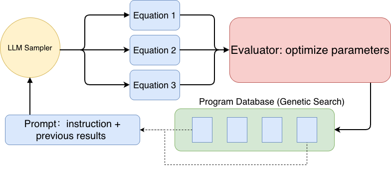

# AlphaEvolve_SymbolicRegression

---

> Inspired by [FunSearch](https://www.nature.com/articles/s41586-023-06924-6). *Nature* (2023); [LLM-SR](https://openreview.net/forum?id=m2nmp8P5in). *ICLR Oral* (2024); [AlphaEvolve](https://deepmind.google/blog/alphaevolve-a-gemini-powered-coding-agent-for-designing-advanced-algorithms/). (2025) - This project integrates the core insights and advancements from these three works.



## Architecture Overview

The architecture consists of three main modules: the **Program Database**, the **LLM Sampler**, and the **Evaluator**. The workflow operates as an iterative loop:

1. **Prompting**: Construct a prompt by selecting historical programs from the database and combining them with specific task instructions. (`programs_database.py`)

2. **Sampling**: Feed this prompt to the LLM Sampler, which generates new candidate equations. (`sampler.py`)

3. **Evaluation**: The Evaluator takes these candidates and uses the provided data to optimize their parameters, then calculates the accuracy of the fit. (`evaluator.py`)

4. **Update**: Valid equations are stored back into the Program Database. These serve as *in-context examples* for future prompts, continuously improving the model's performance in subsequent iterations. (`programs_database.py`)

## File Structure

| File | Description |
|------|-------------|
| `programs_database.py` | Program database with island-based evolutionary algorithm |
| `sampler.py` | LLM interface for generating new equations |
| `evaluator.py` | Sandbox execution and parameter optimization |
| `profiler.py` | TensorBoard logging for database status |
| `checkpoint_util.py` | Checkpoint saving/loading for experiment resumption |
| `config.py` | Configuration parameters for Program Database |
| `code_manipulation.py` | Python code parsing; core data classes for evolution |
| `distribution_util.py` | Utilities for distributed execution |
| `equ_comp.py` | Equation complexity calculation |
| `logging_utils.py` | Logging utilities |

## Quick Start

```bash
# Basic run
python implementation/main_distributed.py \
  --spec_path <spec_path> \
  --data_folder <data_path> \
  --log_folder <log_path> \
  --max_samples 2000 \
  --num_evaluators 4 \
  --num_samplers 2

# Resume from checkpoint
python implementation/main_distributed.py \
  --resume_from_ckpt <log_path>/checkpoints \
  --max_samples 2000

# Monitor with TensorBoard
tensorboard --logdir <log_path> --port 6006
```

---

## Detailed Documentation

### 1. Program Database Structure

The Program Database uses a **hierarchical island-based evolutionary architecture** to maintain population diversity and enable exploration of the solution space.

#### 1.1 Hierarchical Structure

```
ProgramsDatabase
├── Island 0
│   ├── Cluster (complexity_bin=0): [Program, Program, ...]
│   ├── Cluster (complexity_bin=1): [Program, Program, ...]
│   └── ...
├── Island 1
│   └── ...
└── Island N-1
    └── ...
```

- **ProgramsDatabase**: Top-level container managing multiple islands
- **Island**: A sub-population that evolves independently; contains clusters organized by complexity
- **Cluster**: Groups programs with similar complexity (binned by `complexity // 10`)

#### 1.2 Sampling Process

When generating a new prompt, the database performs the following steps:

**Step 1: Island Selection**
```python
island_id = np.random.randint(num_islands)  # Uniform random selection
```

**Step 2: Temperature Scheduling**

The sampling temperature follows a **linear decay** within each period:

$$T = T_{\text{init}} \times \left(1 - \frac{n \mod P}{P}\right)$$

Where:
- $T_{\text{init}}$ = `cluster_sampling_temperature_init` (default: 0.005)
- $P$ = `cluster_sampling_temperature_period` (default: 200)
- $n$ = `global_sample_nums` (current sample count)

**Step 3: Cluster Selection**

Clusters are selected uniformly at random from available complexity bins:
```python
functions_per_prompt = min(len(clusters), functions_per_prompt)
idx = np.random.choice(len(complexity_bins), size=functions_per_prompt)
```

**Step 4: Program Sampling within Cluster**

Programs are sampled using **softmax over scores** with temperature:

$$P(i) = \frac{\exp(s_i / T)}{\sum_j \exp(s_j / T)}$$

Where $s_i$ is the score of program $i$.

#### 1.3 Island Reset Mechanism

To prevent stagnation, the weaker half of islands are periodically reset:

1. Every `reset_period` samples (default: 700), islands are ranked by their best score
2. The bottom 50% of islands are reset
3. Each reset island is re-initialized with the best program from a randomly selected surviving island as its "founder"

#### 1.4 Configuration Parameters (`config.py`)

| Parameter | Default | Description |
|-----------|---------|-------------|
| `functions_per_prompt` | 4 | Number of historical programs to include in each prompt |
| `num_islands` | 10 | Number of parallel islands for diversity |
| `reset_period` | 700 | Samples between island resets |
| `cluster_sampling_temperature_init` | 0.005 | Initial temperature for softmax sampling |
| `cluster_sampling_temperature_period` | 200 | Period for temperature linear decay cycle |
| `cost_per_ktoken` | (0.006, 0.024) | Cost per 1K tokens (input, output) for tracking |

---

### 2. LLM Optimization & Prompt Construction

#### 2.1 Specification File

The specification file (e.g., `specs/specification_example.txt`) defines the symbolic regression task. It contains:

1. **Task Description**: A docstring explaining the problem, background, objectives, and constraints
2. **Helper Functions**: Pre-defined functions like `get_gradients()` for computing derivatives
3. **Evaluation Function**: The `@evaluate.run` decorated function that computes the loss
4. **Target Function**: The `@equation.evolve` decorated function that the LLM will evolve

Example structure:
```python
"""
Task description with:
- Background information
- Objective
- Input/output specifications
- Constraints on allowed operations
- Physical/domain knowledge hints
"""
import ...

# Helper functions
@jax.jit
def get_gradients(...):
    ...

# Evaluation function (fixed, not evolved)
@evaluate.run
def evaluate(data: dict) -> float:
    ...

# Target function to evolve
@equation.evolve
def equation(rho, s, params) -> tuple:
    """Docstring with signature info."""
    # Initial implementation
    ...
```

#### 2.2 Prompt Construction

The prompt is constructed in `Island._generate_prompt()` with the following structure:

```
┌─────────────────────────────────────────────────────────┐
│  TASK DESCRIPTION (from specification docstring)        │
├─────────────────────────────────────────────────────────┤
│  RULES:                                                 │
│  - Preserve function signature and docstring structure  │
│  - Only output the full definition of equation_vN       │
│  - Add inline comments explaining physical meaning      │
├─────────────────────────────────────────────────────────┤
│  PREVIOUS VERSIONS:                                     │
│  ```python                                              │
│  def equation_v0(...):                                  │
│      """Original docstring."""                          │
│      # implementation (lowest score)                    │
│                                                         │
│  def equation_v1(...):                                  │
│      """Improved version of equation_v0."""             │
│      # implementation (medium score)                    │
│                                                         │
│  def equation_v2(...):                                  │
│      """Improved version of equation_v1."""             │
│      # implementation (highest score)                   │
│  ```                                                    │
├─────────────────────────────────────────────────────────┤
│  NOW DEFINE:                                            │
│  ```python                                              │
│  def equation_v3(...):                                  │
│      """Improved version of equation_v2."""             │
│  ```                                                    │
└─────────────────────────────────────────────────────────┘
```

Key implementation details:

1. **Version Naming**: Programs are renamed to `equation_v0`, `equation_v1`, etc.
2. **Score-based Ordering**: Programs are sorted by score (ascending), so the LLM sees progression from worse to better
3. **Docstring Updates**: All versions after v0 get docstrings like "Improved version of equation_vN-1"
4. **Recursive Call Handling**: If the function calls itself, those calls are renamed to the new version name

---

### 3. Equation Parameter Optimization

The evaluator (`evaluator.py`) executes generated equations in a sandboxed subprocess and optimizes their parameters.

#### 3.1 Evaluation Pipeline

```
┌──────────────┐    ┌─────────────────┐    ┌──────────────────┐
│ LLM Sample   │───▶│ Code Parsing    │───▶│ Sandbox Execution│
│ (raw text)   │    │ (extract body)  │    │ (subprocess)     │
└──────────────┘    └─────────────────┘    └──────────────────┘
                                                    │
                                                    ▼
┌──────────────┐    ┌─────────────────┐    ┌──────────────────┐
│ Store Result │◀───│ Complexity Calc │◀───│ Parameter Optim  │
│ (database)   │    │ (equ_comp.py)   │    │ (BFGS + CMA-ES)  │
└──────────────┘    └─────────────────┘    └──────────────────┘
```

#### 3.2 Two-Stage Parameter Optimization

The parameter optimization (defined in the specification's `evaluate` function) uses a **two-stage hybrid approach**:

**Stage 1: BFGS (Gradient-based)**
```python
res_local = minimize(loss_fn, PARAMS_INIT, method='BFGS', jac=grad_fn)
```
- Uses JAX automatic differentiation for gradient computation
- Quickly identifies which parameters are actually used by the equation
- Provides a good initial point for global optimization

**Stage 2: CMA-ES (Evolutionary)**
```python
es = cma.CMAEvolutionStrategy(params_init, 0.5, {
    'bounds': [-5, 5],
    'popsize': 100,
    'maxiter': 300
})
```
- Covariance Matrix Adaptation Evolution Strategy
- Global optimization that escapes local minima
- **Early stopping**: If loss > 0.5 after 100 iterations, stop early to save compute

<!-- #### 3.3 Loss Function Design

The loss function combines two components:

$$\mathcal{L} = c_E \cdot \mathcal{L}_E + c_V \cdot \mathcal{L}_V$$

Where:
- $\mathcal{L}_E$ = **Energy Loss**: Mean squared error of integrated exchange-correlation energy
- $\mathcal{L}_V$ = **Potential Loss**: Mean squared error of exchange-correlation potential (with auto-alignment)
- $c_E = 10^6$, $c_V = 1.0$ (default weights)

**Auto-alignment for Potential Loss**:

The potential has an arbitrary constant shift. The optimal alignment is computed analytically:

$$C_{\text{optimal}} = \frac{\sum_i w_i \rho_i (v_{\text{pred},i} - v_{\text{target},i})}{\sum_i w_i \rho_i}$$

Then: $v_{\text{aligned}} = v_{\text{pred}} - C_{\text{optimal}}$ -->

#### 3.3 Sandbox Execution

Generated code runs in an isolated subprocess for safety:

```python
class Sandbox:
    def run(self, program, function_to_run, data_dict, timeout_seconds):
        # Uses multiprocessing with 'spawn' context
        pool = mp.get_context('spawn').Pool(processes=1)
        async_result = pool.apply_async(_execute_in_subprocess, args=(...))
        result = async_result.get(timeout=timeout_seconds)
```

- **Timeout**: Default 400 seconds per evaluation
- **JIT Compilation**: Equations are JIT-compiled with JAX for performance
- **Error Handling**: Any exception results in `None` score (program discarded)

#### 3.4 Return Values

The evaluation returns:
- `score`: Negative loss (higher is better, stored in database)
- `optimized_params`: Best parameter values found
- `complexity`: Equation complexity score (computed by `equ_comp.py`)
- `complexity_detail`: Breakdown of complexity by operation type