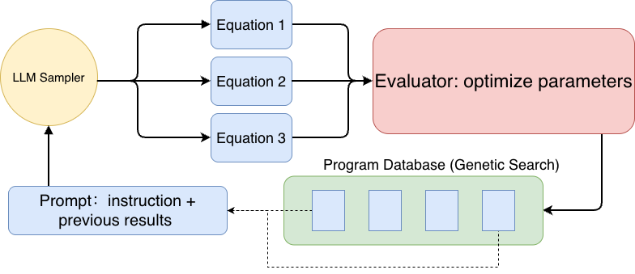

# AlphaEvolve_SymbolicRegression

---

> Inspired by [FunSearch](https://www.nature.com/articles/s41586-023-06924-6). *Nature* (2023); [LLM-SR](https://openreview.net/forum?id=m2nmp8P5in). *ICLR Oral* (2024); [AlphaEvolve](https://deepmind.google/blog/alphaevolve-a-gemini-powered-coding-agent-for-designing-advanced-algorithms/). (2025) - This project integrates the core insights and advancements from these three works.



## Architecture Overview

The architecture consists of three main modules: the **Program Database**, the **LLM Sampler**, and the **Evaluator**. The workflow operates as an iterative loop:

1. **Prompting**: Construct a prompt by selecting historical programs from the database and combining them with specific task instructions. (`database.py`)

2. **Sampling**: Feed this prompt to the LLM Sampler, which generates new candidate equations. (`sampler.py`)

3. **Evaluation**: The Evaluator takes these candidates and uses the provided data to optimize their parameters, then calculates the accuracy of the fit. (`evaluator.py`)

4. **Update**: Valid equations are stored back into the Program Database. These serve as *in-context examples* for future prompts, continuously improving the model's performance in subsequent iterations. (`database.py`)

## Installation

```bash
# Clone the repository
git clone https://github.com/<user>/AlphaEvolve_SymbolicRegression.git
cd AlphaEvolve_SymbolicRegression

# Install in development mode (with test/lint tools)
pip install -e ".[dev]"

# Or install with Gemini support
pip install -e ".[gemini]"

# Or install with example dependencies (CMA-ES)
pip install -e ".[examples]"
```

## File Structure

```
src/alpha_evolve_sr/
├── __init__.py          # Package exports
├── cli.py               # CLI entry point (was main_distributed.py)
├── config.py            # Configuration dataclasses
├── database.py          # Program database with island-based evolutionary algorithm (was programs_database.py)
├── sampler.py           # LLM provider interface and sampling
├── evaluator.py         # Sandbox execution and parameter optimization
├── profiler.py          # TensorBoard logging for database status
├── checkpoint.py        # Checkpoint saving/loading (was checkpoint_util.py)
├── code_manipulation.py # Python code parsing; core data classes for evolution
├── complexity.py        # Equation complexity calculation (was equ_comp.py)
├── workers.py           # Distributed worker processes (was distribution_util.py)
├── logging_config.py    # Unified logging configuration (was logging_utils.py)
└── exceptions.py        # Custom exception hierarchy
tests/
├── test_code_manipulation.py
├── test_complexity.py
├── test_config.py
├── test_database.py
└── test_checkpoint.py
```

## Running & Resuming

| Scenario | Command | Description |
|----------|---------|-------------|
| **Fresh start** | `alpha-evolve-sr --config config.yaml` | Start a new experiment |
| **Resume** | `alpha-evolve-sr --resume <log_dir>` | Resume using config saved in checkpoint DB |
| **Resume + new config** | `alpha-evolve-sr --config new.yaml --resume <log_dir>` | Resume with updated config |

- `--resume` points to the directory containing `checkpoint.db` (by default, `log_dir`).
- When using `--resume` alone, the config is loaded from the checkpoint database — no `--config` needed.
- When using both, the new config overrides the old one (structural fields like `num_islands` and `complexity_bin_size` must match).

```bash
# Monitor with TensorBoard
tensorboard --logdir <log_dir> --port 6006
```

## Documentation

Full architecture and reference documentation is built with Sphinx:

```bash
pip install -e ".[docs]"
cd docs && make html
open _build/html/index.html
```

