# Architecture Document — AlphaEvolve Symbolic Regression

> **Version**: 0.2.0 | **Date**: 2026-02-13 | **Status**: As-Is Analysis + Refactoring Proposal

---

## Table of Contents

1. [System Overview](#1-system-overview)
2. [Component Responsibilities](#2-component-responsibilities)
3. [Data Flow](#3-data-flow)
4. [Class Relationships](#4-class-relationships)
5. [Sequence Diagrams](#5-sequence-diagrams)
6. [Issue Inventory](#6-issue-inventory)
7. [Refactoring Plan](#7-refactoring-plan)

---

## 1. System Overview

<!-- 系统整体是一个 LLM 引导的进化搜索框架，用于符号回归。
     核心循环：Database 提供 prompt → Sampler 调用 LLM 生成候选方程 → Evaluator 沙箱执行+参数优化 → 结果写回 Database -->

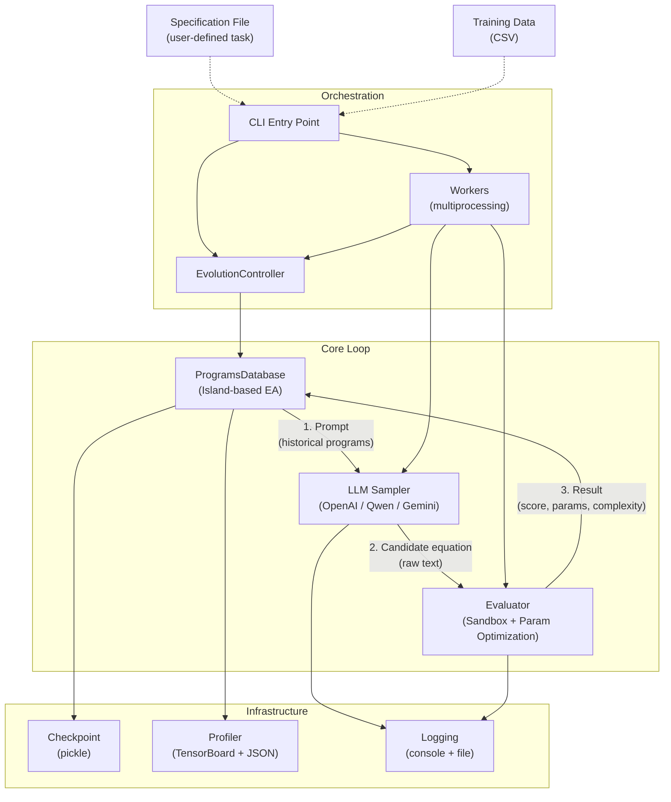

### Two Execution Modes

<!-- 系统支持两种运行模式，共享核心组件但编排方式不同 -->

| Mode | Entry Point | Parallelism | Use Case |
|------|-------------|-------------|----------|
| **Distributed** | `main_distributed()` | Multiple OS processes via `mp.Process` | Production runs |
| **Non-distributed** | `main_single()` | Single process, sequential | Debugging / small experiments |

---

## 2. Component Responsibilities

<!-- 每个模块的单一职责定义 -->

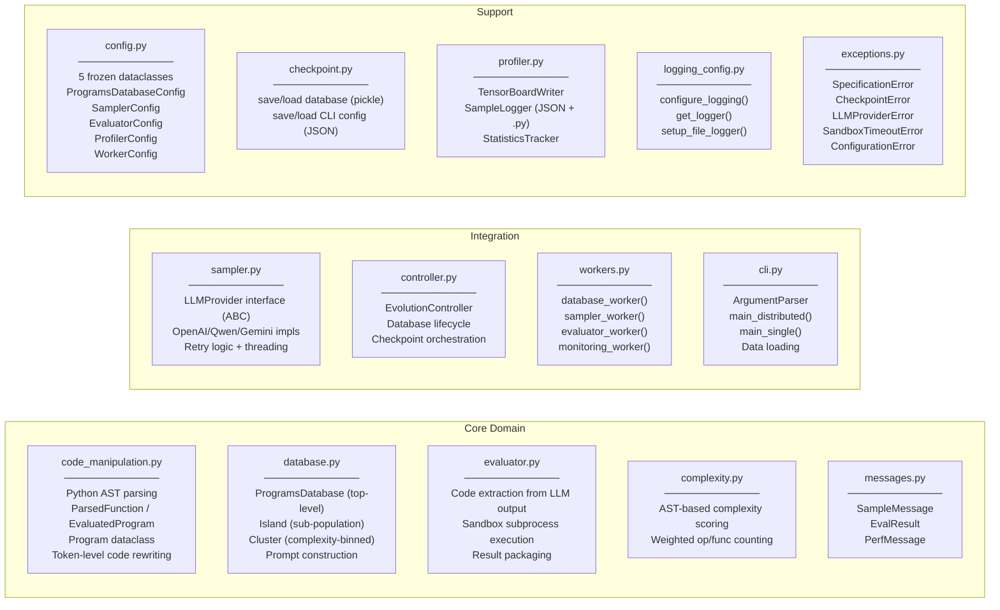

### Module Size Distribution

<!-- 模块大小分布反映了复杂度分配 -->

```
workers.py           ████████████████████████████████████████
controller.py        ██████████████████████████████
profiler.py          ████████████████████████████████████
cli.py               █████████████████████████████████
code_manipulation.py █████████████████████████████████
database.py          ████████████████████████████████
sampler.py           ████████████████████
evaluator.py         ███████████████████
complexity.py        ███████████
messages.py          ███████
config.py            ██████████
checkpoint.py        ██████
logging_config.py    ████
exceptions.py        ██
```

---

## 3. Data Flow

### 3.1 Distributed Mode — Queue-based Pipeline

<!-- 分布式模式通过 5 个 multiprocessing.Queue 连接 4 类 worker 进程 -->

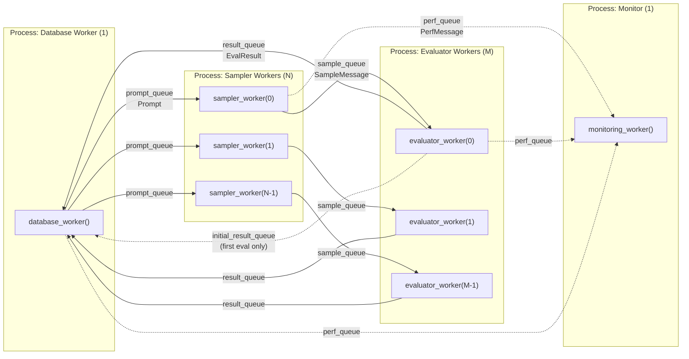

### 3.2 Message Types Flowing Through Queues

<!-- 队列中传递的消息现在全部是 typed dataclasses -->

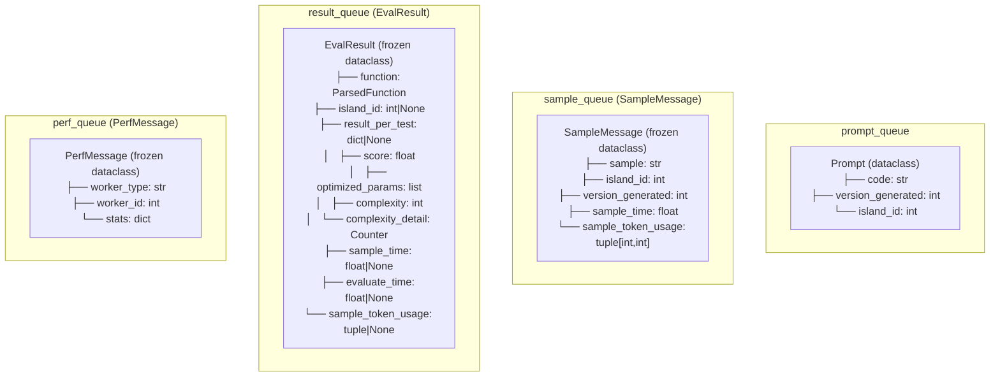

### 3.3 Backpressure Mechanism

<!-- 背压机制通过两个共享计数器实现，防止队列无限增长 -->

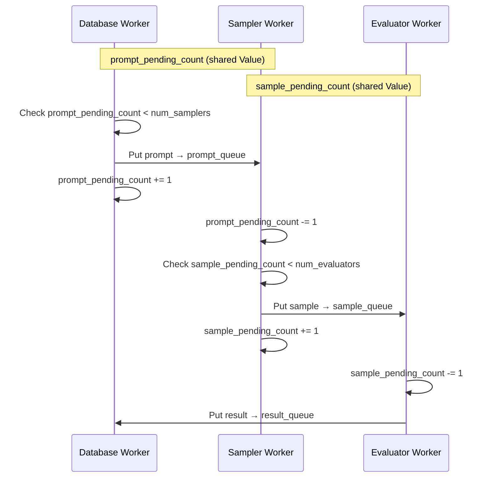

---

## 4. Class Relationships

### 4.1 Core Domain Classes

<!-- 核心领域模型的类图 -->

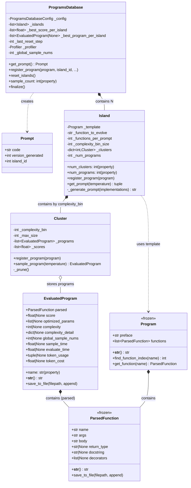

### 4.2 Sampler Layer

<!-- Sampler 使用策略模式支持多 LLM 提供商 -->

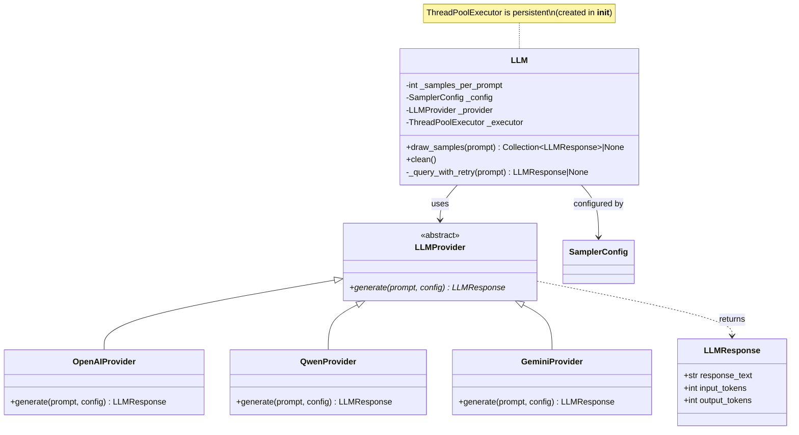

### 4.3 Evaluator + Sandbox

<!-- Evaluator 在沙箱子进程中执行 LLM 生成的代码 -->

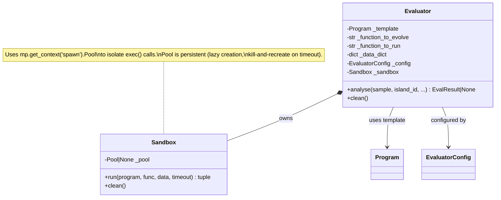

### 4.4 Profiler Decomposition

<!-- Profiler 内部已做了良好的职责拆分 -->

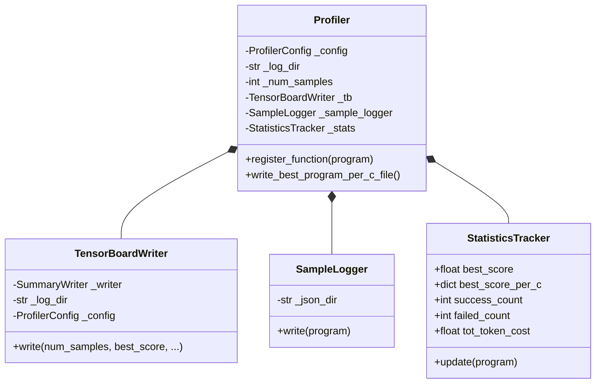

### 4.5 Configuration Hierarchy

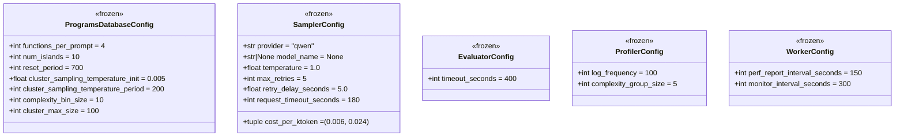

---

## 5. Sequence Diagrams

### 5.1 Main Evolution Loop (Non-Distributed)

<!-- 非分布式模式的完整执行流程 -->

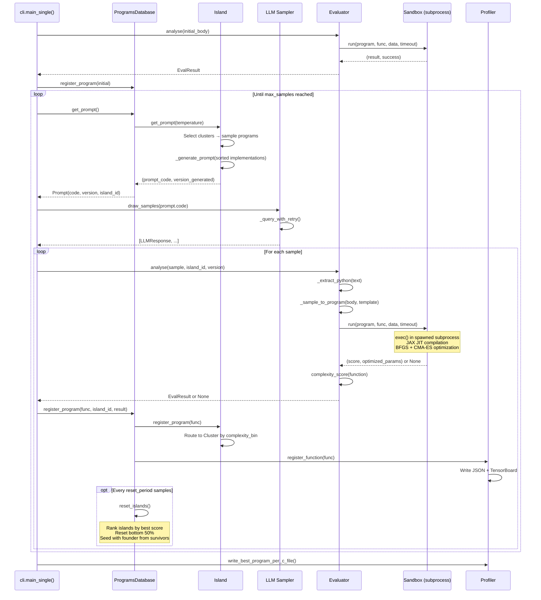

### 5.2 Distributed Mode — Process Lifecycle

<!-- 分布式模式的进程生命周期管理 -->

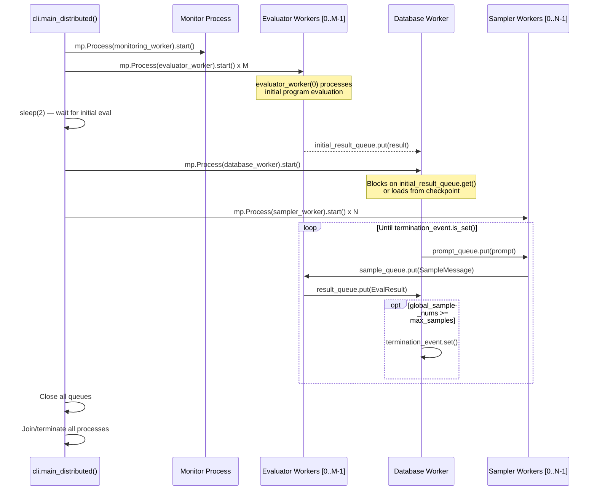

### 5.3 Prompt Construction Detail

<!-- Prompt 构造是核心竞争力所在，值得详细展开 -->

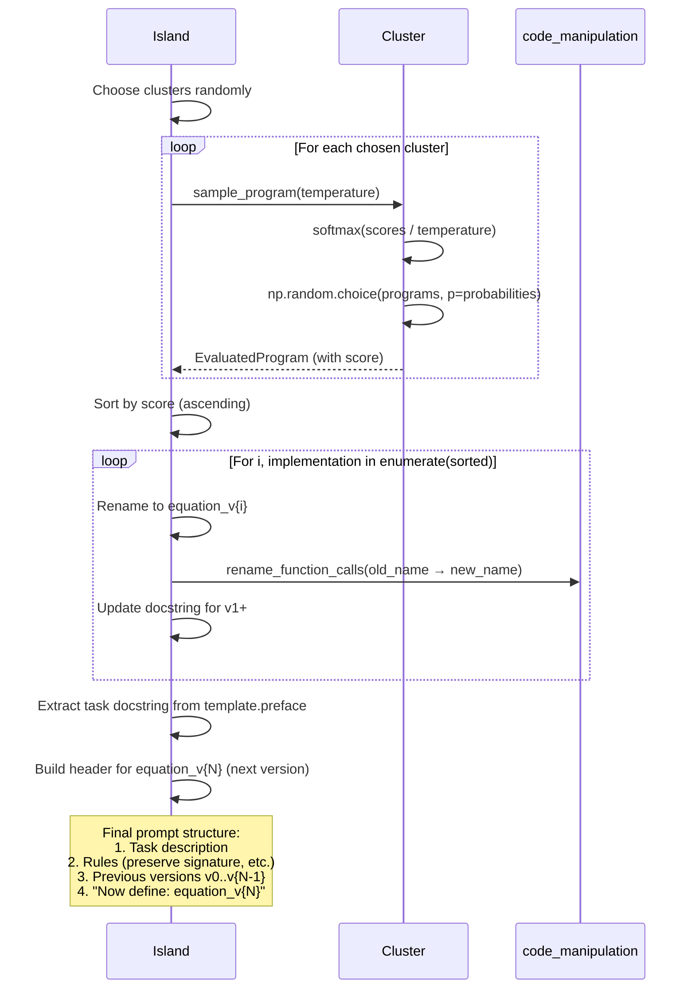

### 5.4 Island Reset Mechanism

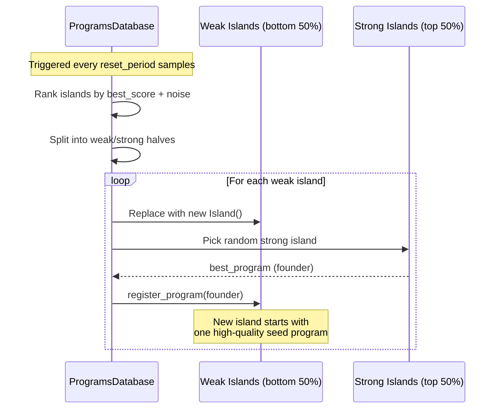

---

## 6. Issue Inventory

<!-- 问题清单，按严重程度和模块分类 -->

### P0 — Runtime Bugs

| # | Module | Line | Issue | Impact |
|---|--------|------|-------|--------|
| 1 | `cli.py` | 214 | ~~`main_single` 用 `sample_info[0]` 访问 dict~~  | ✅ RESOLVED — uses `sample_info["response_text"]` + `None` guard |
| 2 | `code_manipulation.py` | 194 | ~~使用 `ast.Str`（Python 3.12 已移除）~~ | ✅ RESOLVED — replaced with `ast.Constant` + `isinstance(value, str)` |

### P1 — Encapsulation Violations

| # | Module | Line | Issue |
|---|--------|------|-------|
| 3 | `workers.py` | 38, 125 | ~~访问 `db._global_sample_nums`~~ | ✅ RESOLVED — uses `db.sample_count` property |
| 4 | `workers.py` | 159 | ~~访问 `db._profiler.write_best_program_per_c_file()`~~ | ✅ RESOLVED — uses `db.finalize()` |
| 5 | `cli.py` | 188, 235 | ~~访问 `database._global_sample_nums`~~ | ✅ RESOLVED — uses `database.sample_count` property |
| 6 | `cli.py` | 241 | ~~访问 `database._profiler.write_best_program_per_c_file()`~~ | ✅ RESOLVED — uses `database.finalize()` |
| 7 | `database.py` | 139 | ~~访问 `island._clusters`, `island._num_programs`~~ | ✅ RESOLVED — uses `island.num_clusters`, `island.num_programs` properties |

### P2 — Design Smells

| # | Issue | Affected Modules |
|---|-------|-----------------|
| 8 | ~~`Function` dataclass 混合了 3 种关注点 (14 fields)~~ | ✅ RESOLVED — split into `ParsedFunction` (frozen, 6 fields) + `EvaluatedProgram` (10 eval/runtime fields) |
| 9 | ~~`Function.__setattr__` 隐式修改入参~~ | ✅ RESOLVED — `value: object` type hint + `isinstance` guards |
| 10 | ~~`exceptions.py` 定义了 5 个异常但从未使用~~ | ✅ RESOLVED — `SpecificationError`, `CheckpointError`, `LLMProviderError` wired up |
| 11 | ~~Queue 消息为 raw dict，无类型合约~~ | ✅ RESOLVED — `SampleMessage`, `EvalResult`, `PerfMessage` dataclasses in `messages.py` |
| 12 | ~~Workers 用 `object` 类型标注~~ | ✅ RESOLVED — `argparse.Namespace`, `code_manipulation.Program`, `logging.Logger` |
| 13 | ~~`SamplerConfig` 未传递给 worker 进程~~ | ✅ RESOLVED — CLI args `--llm_provider/model/temperature` → `SamplerConfig` → workers |
| 14 | ~~`ThreadPoolExecutor` 每次 `draw_samples` 重建~~ | ✅ RESOLVED — persistent executor created in `__init__` |
| 15 | ~~`load_dotenv()` 在模块导入时执行~~ | ✅ RESOLVED — moved to `LLM.__init__` |

### P3 — Reliability / Resource

| # | Issue | Module | Line |
|---|-------|--------|------|
| 16 | ~~`Cluster` 无限增长，无剪枝机制~~ | ~~`database.py`~~ | ✅ RESOLVED — `Cluster` accepts `max_size` (default 100) and prunes lowest-scoring programs |
| 17 | ~~Monitoring worker 硬编码日志路径 `"./logger"`~~ | ~~`workers.py`~~ | ✅ RESOLVED — uses `args.log_path` with `"./logger"` fallback |
| 18 | ~~Profiler 计数逻辑在乱序 sample 下会丢失~~ | ~~`profiler.py`~~ | ✅ RESOLVED — high-water mark tracking; all samples logged unconditionally |
| 19 | Pickle checkpoint 对类重命名/移动脆弱 | `checkpoint.py` | — |

### P4 — Security

| # | Issue | Module |
|---|-------|--------|
| 20 | `exec()` 沙箱无文件系统/网络/内存限制 | `evaluator.py` |

### New Issues (Post-Refactoring)

| # | Sev | Issue | Status |
|---|-----|-------|--------|
| 21 | P2 | `Evaluator.analyse()` returns raw `dict\|None` — last untyped boundary | ✅ RESOLVED — returns `EvalResult` |
| 22 | P2 | Sandbox creates/destroys `mp.Pool` per evaluation (~3600 cycles/run) | ✅ RESOLVED — persistent pool (lazy creation, kill-and-recreate on timeout) |
| 23 | P2 | No Pareto-aware selection — score only, complexity unused in ranking | Being implemented |
| 24 | P2 | Duplicated orchestration in `main_single` vs `database_worker` (~70% overlap) | ✅ RESOLVED — `EvolutionController` |
| 25 | P3 | `_generate_prompt()` does `copy.deepcopy` per prompt | ✅ RESOLVED — uses `dataclasses.replace()` |
| 26 | P3 | `LLM._query_with_retry` returns raw dict, discards typed `LLMResponse` | ✅ RESOLVED — returns `LLMResponse` |
| 27 | P3 | Specification uses DFT-specific prompt templates | Open |
| 28 | P3 | Zero test coverage for `evaluator.py` | ✅ RESOLVED — tests in `test_evaluator.py` |

---

## 7. Refactoring Plan

<!-- 重构方案分三个阶段，每个阶段内保持系统可运行 -->

### Phase 1: Fix Bugs + Improve Type Safety ✅ COMPLETE

<!-- 第一阶段：修 bug、加类型、不改架构 -->

**Goal**: Fix runtime bugs and make the codebase type-safe without changing architecture.

```
Estimated effort: 1-2 days
Risk: Low — no architectural changes
Status: ✅ COMPLETE
```

#### 1.1 Fix P0 Bugs ✅

```python
# cli.py:214 — Fix dict access in main_single
# Before (broken):
eval_result = evaluators.analyse(
    sample_info[0], prompt.island_id, ...
)
# After:
eval_result = evaluators.analyse(
    sample_info["response_text"], prompt.island_id, ...,
    sample_token_usage=(sample_info["input_tokens"], sample_info["output_tokens"]),
)

# code_manipulation.py:194 — Fix ast.Str deprecation
# Before:
isinstance(node.body[0].value, ast.Str)
# After:
isinstance(node.body[0].value, ast.Constant) and isinstance(node.body[0].value.value, str)
```

#### 1.2 Add Public Properties to Database/Island ✅

```python
# database.py — Add properties
class ProgramsDatabase:
    @property
    def sample_count(self) -> int:
        return self._global_sample_nums

    def finalize(self) -> None:
        """Write final outputs and close resources."""
        self._profiler.write_best_program_per_c_file()

class Island:
    @property
    def num_clusters(self) -> int:
        return len(self._clusters)

    @property
    def num_programs(self) -> int:
        return self._num_programs
```

#### 1.3 Define Message Types ✅

```python
# messages.py
@dataclasses.dataclass(frozen=True)
class SampleMessage:
    sample: str
    island_id: int
    version_generated: int
    sample_time: float
    sample_token_usage: tuple[int, int]

@dataclasses.dataclass(frozen=True)
class EvalResult:
    function: ParsedFunction
    island_id: int | None
    result_per_test: dict | None
    sample_time: float | None
    evaluate_time: float | None
    sample_token_usage: tuple[int, int] | None

@dataclasses.dataclass(frozen=True)
class PerfMessage:
    worker_type: str
    worker_id: int
    stats: dict
```

#### 1.4 Use Custom Exceptions ✅

```python
# evaluator.py — replace generic exceptions
from .exceptions import SandboxTimeoutError
# In Sandbox.run():
except mp.TimeoutError:
    raise SandboxTimeoutError(f"Timed out after {timeout_seconds}s")

# sampler.py
from .exceptions import LLMProviderError
# In _query_with_retry():
raise LLMProviderError("All retries failed")
```

#### 1.5 Pass SamplerConfig Through CLI → Workers ✅

```python
# cli.py — Add sampler config CLI args
parser.add_argument("--llm_provider", default="qwen")
parser.add_argument("--llm_model", default=None)
parser.add_argument("--llm_temperature", type=float, default=1.0)

# workers.py — sampler_worker receives config
def sampler_worker(..., sampler_config: SamplerConfig | None = None):
    llm = sampler_mod.LLM(config=sampler_config)
```

---

### Phase 2: Separate Concerns in Function Dataclass ✅ COMPLETE

<!-- 第二阶段：拆分 Function 的职责，已完成 -->

**Goal**: Split `Function` into `ParsedFunction` (immutable AST data) and `EvaluatedProgram` (runtime results).

```
Estimated effort: 2-3 days
Risk: Medium — touches many modules, needs careful migration
Status: ✅ COMPLETE
```

#### Result

```mermaid
graph LR
    subgraph "Before"
        F1["Function<br/>14 fields<br/>parsing + eval + runtime"]
    end

    subgraph "After (implemented)"
        F2["ParsedFunction<br/>frozen=True<br/>name, args, body,<br/>return_type, docstring,<br/>decorators"]
        F3["EvaluatedProgram<br/>parsed: ParsedFunction<br/>score, optimized_params,<br/>complexity, complexity_detail,<br/>global_sample_nums, sample_time,<br/>evaluate_time, token_usage,<br/>token_cost"]
    end

    F1 -.->|split into| F2
    F1 -.->|split into| F3
    F3 *-- F2
```

- `ParsedFunction` is a frozen dataclass with 6 fields (pure AST data)
- `EvaluatedProgram` composes a `ParsedFunction` with evaluation and runtime metrics
- `Program.functions` is now `list[ParsedFunction]`
- `Cluster` stores `EvaluatedProgram` instances
- `Function` remains as a backward-compatibility alias for `ParsedFunction`

---

### Phase 2.5: EvolutionController ✅ COMPLETE

**Goal**: Extract duplicated orchestration logic from `main_single` and `database_worker` into a shared `EvolutionController`.

```
Status: ✅ COMPLETE — controller.py implements EvolutionController
```

The `EvolutionController` manages database lifecycle (init, register, checkpoint, finalize) and is used by both `cli.py` and `workers.py`, eliminating the ~70% code overlap.

---

### Phase 3: Architectural Improvements

<!-- 第三阶段：架构级改动，需要根据项目方向决定 -->

**Goal**: Improve reliability, extensibility, and operational maturity.

```
Estimated effort: 3-5 days
Risk: Higher — architectural changes, needs design decisions
```

#### 3.1 Cluster Pruning ✅ COMPLETE

```python
class Cluster:
    def __init__(self, complexity_bin, implementation, max_size=100):
        ...

    def register_program(self, program):
        self._programs.append(program)
        self._scores.append(program.score)
        if len(self._programs) > self._max_size:
            self._prune()

    def _prune(self):
        """Remove lowest-scoring programs to stay within max_size."""
        ...
```

Cluster max size is configurable via `ProgramsDatabaseConfig.cluster_max_size` (default 100).

#### 3.2 Pareto-Aware Selection (Next Step)

Currently, selection in `Cluster.sample_program()` ranks by score only; complexity is used only for binning. The next step is to implement Pareto-aware selection that considers both score and complexity when ranking candidates.

#### 3.3 Checkpoint Format Migration

```
Option A: JSON + separate .py files (human-readable, version-resilient)
Option B: SQLite (queryable, atomic writes)
Option C: Keep pickle but add version header + migration support
```

#### 3.4 Prompt Template Extraction

```python
class PromptTemplate:
    """Configurable prompt builder, separating content from construction logic."""
    def __init__(self, task_description: str, rules: list[str]):
        ...

    def build(self, implementations: list[EvaluatedProgram], next_version: int) -> str:
        ...
```

#### 3.5 Enhanced Sandbox (if needed for production)

```
- Use subprocess with resource limits (ulimit)
- Network namespace isolation (Linux only)
- Filesystem restrictions via tempdir + chroot
- Memory limit via cgroups or resource module
```

---

### Refactoring Dependency Graph

<!-- 重构阶段之间的依赖关系 -->

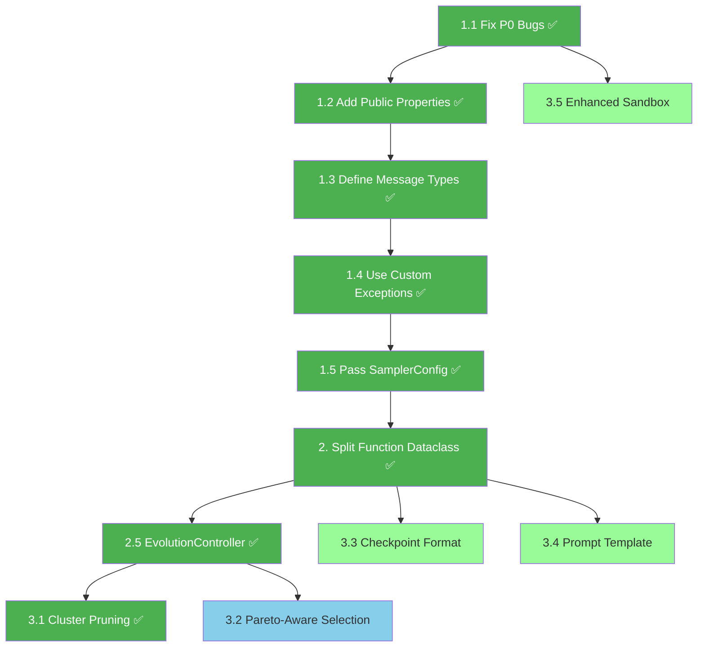

**Legend**: Green = completed, Blue = in progress, Light green = planned

---

## Appendix: Module Dependency Matrix

<!-- 模块间依赖矩阵，▶ 表示直接导入 -->

| Module ↓ imports → | config | code_manip | database | sampler | evaluator | complexity | profiler | checkpoint | logging | exceptions | messages | controller |
|--------------------|--------|-----------|----------|---------|-----------|-----------|----------|-----------|---------|-----------|----------|-----------|
| **cli.py** | ▶ | ▶ | | ▶ | ▶ | | | ▶ | ▶ | ▶ | | ▶ |
| **workers.py** | ▶ | ▶ | | ▶ | ▶ | | | | ▶ | | ▶ | ▶ |
| **controller.py** | ▶ | ▶ | ▶ | | | | | ▶ | ▶ | | ▶ | |
| **database.py** | ▶ | ▶ | | | | | ▶ | | ▶ | | | |
| **evaluator.py** | ▶ | ▶ | | | | ▶ | | | ▶ | | ▶ | |
| **sampler.py** | ▶ | | | | | | | | ▶ | ▶ | | |
| **profiler.py** | ▶ | ▶ | | | | | | | ▶ | | | |
| **complexity.py** | | | | | | | | | ▶ | | | |
| **checkpoint.py** | | | TYPE_ONLY | | | | | | ▶ | ▶ | | |
| **messages.py** | | ▶ | | | | | | | | | | |
| **exceptions.py** | | | | | | | | | | | | |
